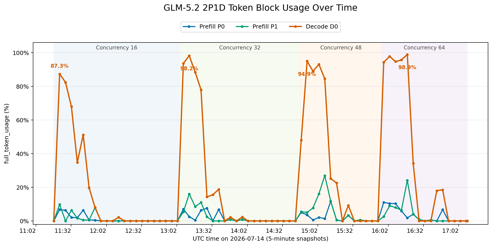
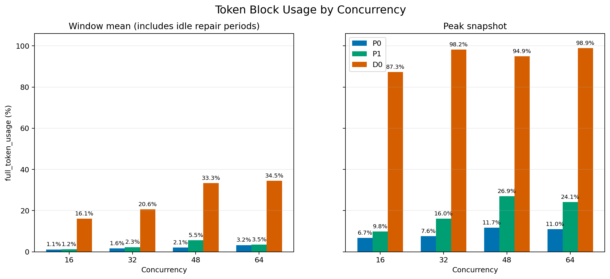
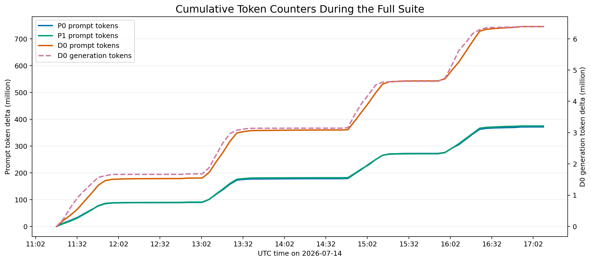

# GLM-5.2 2P1D Token Usage 时序分析

运行 ID：`full-glm47-20260714T111635Z`  
采样范围：`2026-07-14T11:17:09.822004+00:00` 至 `2026-07-14T17:09:20.977608+00:00`  
采样间隔：5 分钟，共 72 个采样点；监控采样错误数：0。

## 核心结论

- `full_token_usage` 表示 SGLang token/KV block 池的瞬时占用率，不是 token/s 吞吐。
- Decode D0 是主要容量压力点：并发 32、48、64 的峰值分别达到 98.17%、94.94%、98.90%。
- Prefill P0/P1 呈短促脉冲，长期累计 prompt token 分配接近 50/50；Prefill 完成后会传输并释放 KV，而 Decode 需要保留长对话 KV。
- 全部节点所有 `pending_prealloc_token_usage` 采样均为 0，没有发现持续的 token block 预分配积压。
- 每档后半段的大量零值主要来自 41 个任务在预处理阶段持续补跑失败，不代表 2P1D 服务中断。
- 5 分钟采样可能漏掉短于采样周期的 Prefill 峰值，因此 Prefill 均值应视为稀疏快照统计。

## 完整时序

并发档位背景色依据每档 `timing.json` 标注；Decode 峰值已直接标在曲线上。

## 分档对比

| 并发 | UTC 时间 | 活跃采样 | Prefill 均值 | Prefill 峰值 | Decode 均值 | Decode 峰值 | Decode 峰值 tokens |
|---|---|---|---|---|---|---|---|
| 16 | 11:17–13:04 | 8/22 | 1.16% | 8.25% | 16.06% | 87.29% | 977,344 |
| 32 | 13:04–14:47 | 9/20 | 1.93% | 9.29% | 20.56% | 98.17% | 1,099,072 |
| 48 | 14:47–15:56 | 9/14 | 3.80% | 14.16% | 33.31% | 94.94% | 1,062,912 |
| 64 | 15:56–17:09 | 10/16 | 3.34% | 13.00% | 34.49% | 98.90% | 1,107,328 |

窗口均值包含补跑不可运行任务时的空闲阶段，因此显著低于活跃阶段。

## 节点明细

| 并发 | 节点 | 非零采样 | 窗口均值 | 非零均值 | 峰值 | 峰值时间 UTC | 峰值 used tokens |
|---|---|---|---|---|---|---|---|
| 16 | P0 | 7/22 | 1.11% | 3.49% | 6.73% | 11:22:10 | 207,168 |
| 16 | P1 | 6/22 | 1.21% | 4.45% | 9.77% | 11:22:10 | 300,928 |
| 16 | D0 | 8/22 | 16.06% | 44.18% | 87.29% | 11:22:10 | 977,344 |
| 32 | P0 | 8/20 | 1.62% | 4.04% | 7.58% | 13:27:37 | 233,472 |
| 32 | P1 | 7/20 | 2.25% | 6.43% | 16.04% | 13:12:33 | 493,888 |
| 32 | D0 | 9/20 | 20.56% | 45.69% | 98.17% | 13:12:33 | 1,099,072 |
| 48 | P0 | 9/14 | 2.06% | 3.20% | 11.66% | 15:12:59 | 358,976 |
| 48 | P1 | 9/14 | 5.54% | 8.61% | 26.94% | 15:07:58 | 829,440 |
| 48 | D0 | 8/14 | 33.31% | 58.30% | 94.94% | 14:52:54 | 1,062,912 |
| 64 | P0 | 9/16 | 3.22% | 5.72% | 10.99% | 15:58:08 | 338,240 |
| 64 | P1 | 8/16 | 3.47% | 6.94% | 24.13% | 16:18:14 | 743,040 |
| 64 | D0 | 8/16 | 34.49% | 68.98% | 98.90% | 16:18:14 | 1,107,328 |

## 累计 Token Counter

| 节点 | Prompt token 增量 | Generation token 增量 |
|---|---|---|
| P0 | 371,499,021 | 6,810 |
| P1 | 374,926,110 | 6,922 |
| D0 | 746,151,153 | 6,389,981 |

P0 与 P1 的 prompt token 增量差异很小，D0 的 prompt token 增量接近两者之和；D0 承担了几乎全部 generation token。

## 与请求性能的对应关系

| 并发 | 完整 trajectory | 成功请求 | 请求错误 | 平均 TTFT | 平均 TPOT | Cache hit |
|---|---|---|---|---|---|---|
| 16 | 67 | 3,552 | 70 | 2.19 s | 4.15 ms | 93.96% |
| 32 | 67 | 3,339 | 38 | 4.65 s | 4.47 ms | 94.44% |
| 48 | 67 | 3,268 | 144 | 9.75 s | 4.55 ms | 93.39% |
| 64 | 68 | 3,573 | 74 | 11.46 s | 4.85 ms | 94.50% |

随着 Decode token pool 从并发 32 开始频繁达到 95%–99%，平均 TTFT 从并发 16 的 2.19 秒上升到并发 64 的 11.46 秒。两者趋势一致，但由于 5 分钟采样较稀疏，不能仅凭该图证明严格因果关系。

## 数据与方法

- 原始采样：`/mnt/shared/glm52-stack/toolathlon-runs/glm52-2p1d/full-glm47-20260714T111635Z/monitor/samples.jsonl`
- 请求与聚合指标：`/mnt/shared/glm52-stack/toolathlon-runs/glm52-2p1d/full-glm47-20260714T111635Z/suite_summary.json`
- 分档时间：各 `concurrency-*/timing.json`
- 本目录处理后时序：[`token_usage_timeseries.csv`](token_usage_timeseries.csv)
- SVG 矢量图：[`timeline`](token_usage_timeline.svg)、[`concurrency comparison`](token_usage_by_concurrency.svg)、[`counters`](token_counters_timeline.svg)
- 生成脚本：`experiments/glm52_2p1d/plot_token_usage.py`
